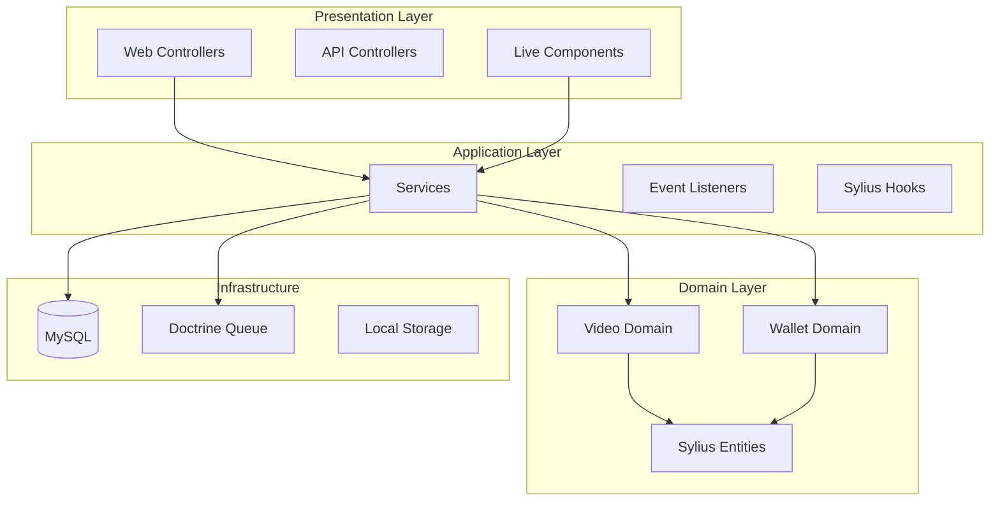

# 🏗️ Architecture globale

Documentation technique de l'architecture VideoAI Studio basée sur Sylius 2.x avec patterns PHP 8+ modernes.

## 📐 Vue d'ensemble

VideoAI Studio suit une architecture **Domain-Driven Design (DDD)** avec séparation claire des responsabilités :



## 🏛️ Structure des domaines

### 📁 Organisation DDD

```
src/
├── Entity/                   # 🏪 Entités Sylius étendues
│   ├── Customer/            # Customer avec HasWalletTrait
│   ├── Product/             # Produits standards Sylius
│   ├── Order/               # Commandes Sylius
│   └── ...                  # Autres entités Sylius
│
├── Shared/                  # 🤝 Interactions cross-domain
│   ├── Fixture/             # Fixtures avec prix dynamiques
│   ├── Payment/             # 🔌 Interfaces de paiement
│   │   └── PaymentProviderInterface.php
│   └── PaymentMethod/       # Resolvers cross-domain
│
├── Video/                   # 🎬 Domain Vidéo IA
└── Wallet/                  # 💰 Domain Wallet/Tokens
```

**➡️ Voir les documentations détaillées :**
- **[Video Domain](video-domain.md)** - Système de génération vidéo IA
- **[Wallet Domain](wallet-domain.md)** - Système wallet/tokens
- **[Shared Domain](shared-domain.md)** - Interactions cross-domain

## 🧩 Patterns utilisés dans le projet

### ✅ Sylius Resource API avec PHP 8+ Attributes

Exemple avec VideoGeneration (détails dans [Video Domain](video-domain.md)) et Wallet (détails dans [Wallet Domain](wallet-domain.md)).

### ✅ Enums PHP 8+ pour les types

Utilisation d'enums typés pour les statuts et types (voir [Video Domain](video-domain.md) et [Wallet Domain](wallet-domain.md)).

### ✅ Live Components avec UX

Utilisation de **Symfony UX Live Components** pour l'interactivité (voir détails dans [Wallet Domain](wallet-domain.md)).

### ✅ CQRS pour les paiements Wallet

Pattern **Command/CommandHandler** pour traiter les paiements wallet (voir détails dans [Wallet Domain](wallet-domain.md)).

## 🔌 Configuration réelle

### Grids Sylius

```yaml
# config/grids/wallet.yaml
sylius_grid:
    grids:
        app_admin_wallet:
            driver:
                name: doctrine/orm
                options:
                    class: App\Wallet\Entity\Wallet
            fields:
                id:
                    type: string
                    label: ID
                customer:
                    type: twig
                    label: Client
                    options:
                        template: '@SyliusAdmin/shared/grid/field/customer.html.twig'
                balance:
                    type: string
                    label: app.ui.wallet_balance
            actions:
                item:
                    show:
                        type: show
```

### Hooks Sylius 2.x

```yaml
# config/packages/hooks/wallet.yaml
sylius_twig_hooks:
    hooks:
        'sylius_admin.wallet.show.content':
            transactions:
                template: 'admin/wallet/show_content.html.twig'
                priority: 100
```

### Services configurés

```yaml
# config/services.yaml - Configuration actuelle
App\Wallet\Payment\CommandHandler\PayWalletCommandHandler:
    arguments:
        $paymentRequestStateMachine: '@debug.state_machine.sylius_payment_request'
        $paymentStateMachine: '@debug.state_machine.sylius_payment'
```

## 🎭 Templates et Fixtures

### Templates
Structure de templates organisée par domaine (voir détails dans [Shared Domain](shared-domain.md)).

### Fixtures  
Données de test complètes pour tous les domaines :

```bash
# Installation complète avec toutes les fixtures
php bin/console sylius:fixtures:load ai_video_suite --no-interaction
```

## ⚙️ Configuration technique réelle

### Packages configurés

```
config/packages/
├── sylius_*.yaml           # Configuration Sylius core
├── hooks/                  # Hooks Sylius 2.x 
│   ├── wallet.yaml
│   ├── video.yaml
│   ├── homepage.yaml
│   └── ...
├── doctrine.yaml           # ORM avec MySQL
├── messenger.yaml          # Queue avec Doctrine
├── twig_component.yaml     # Live Components UX
├── webpack_encore.yaml     # Assets JS/CSS
└── workflow.yaml           # State machines Sylius
```


## 🔄 Flux principaux

### Génération de vidéo
User → Génération → Débit tokens → Traitement IA → Résultat  
(voir détails dans [Video Domain](video-domain.md))

### Achat de tokens  
User → Panier → Paiement réel → Crédit wallet → Tokens disponibles  
(voir détails dans [Wallet Domain](wallet-domain.md))

---

