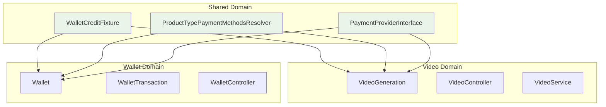
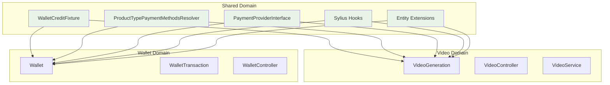

# Shared Domain & Sylius Extensions

Le domaine **Shared** gère les interactions cross-domain entre Video et Wallet, ainsi que toutes les extensions et modifications apportées au framework Sylius.

## 🎯 Rôle

Contient tout ce qui :
- Nécessite une connaissance simultanée des domaines Video ET Wallet
- Étend ou modifie le comportement natif de Sylius
- Gère les interactions entre les domaines métier

## 📁 Structure

```
src/Shared/
├── Fixture/
│   └── WalletCreditFixture.php          # Fixtures avec VideoGenerationCostCalculator
├── Payment/
│   └── PaymentProviderInterface.php     # Interface de paiement abstraite
└── PaymentMethod/
    └── Resolver/
        └── ProductTypePaymentMethodsResolver.php  # Filtre selon Video/Wallet products
```

## 🏪 Entités Sylius étendues

### Customer avec Wallet
Extension de l'entité Customer pour intégrer le système de wallet :

```php
// src/Entity/Customer/Customer.php
class Customer extends BaseCustomer 
{
    use HasWalletTrait;  // Ajoute la relation OneToOne avec Wallet
}
```

**Impact** : Chaque customer dispose automatiquement d'un wallet pour les tokens.

## 🔧 Composants

### PaymentProviderInterface

**Localisation** : `src/Shared/Payment/PaymentProviderInterface.php`

Interface abstraite pour découpler le domaine Video du domaine Wallet :

```php
interface PaymentProviderInterface
{
    public function canAfford(Customer $customer, int $amount): bool;
    public function charge(Customer $customer, int $amount, string $reason): int;
    public function getType(): string;
}
```

**Implémentation** : `WalletPaymentProvider` dans le domaine Wallet
**Utilisation** : Services Video pour vérifier et traiter les paiements

### WalletCreditFixture

**Localisation** : `src/Shared/Fixture/WalletCreditFixture.php`

- Gère les transactions wallet avec **prix dynamiques** pour les générations vidéo
- Utilise `VideoGenerationCostCalculator` pour la cohérence des prix
- Supporte les dates relatives (`days_ago`) pour des fixtures toujours fraîches

**Fonctionnalités** :
- Conversion automatique enum `TransactionType::fromString()`
- Prix dynamique pour références `VIDEO_GENERATION_*`
- Dates calculées relativement à aujourd'hui

### ProductTypePaymentMethodsResolver

**Localisation** : `src/Shared/PaymentMethod/Resolver/ProductTypePaymentMethodsResolver.php`

- Filtre les méthodes de paiement selon le type de produit dans le panier
- **Token packs** → toutes méthodes sauf wallet
- **Générations vidéo** → uniquement wallet

## 🎯 Pourquoi Shared ?

Au lieu de coupler Video ↔ Wallet directement, le domaine Shared :

✅ **Préserve l'indépendance** des domaines métier  
✅ **Centralise les interactions** cross-domain  
✅ **Maintient la cohérence** des prix et règles métier  
✅ **Facilite les tests** et la maintenance  

## 📊 Architecture



## 🛣️ Routes shop overridées

### Routing principal modifié
Le fichier `config/routes/sylius_shop.yaml` override complètement le routing shop natif.

**Différences principales avec Sylius natif :**

#### ❌ Routes désactivées
```yaml
# NATIF Sylius (vendor/...)
sylius_shop_product:           # Routes produits classiques
sylius_shop_product_review:    # Reviews produits

# NOTRE OVERRIDE (config/routes/sylius_shop.yaml)  
# sylius_shop_product: DÉSACTIVÉ - utiliser /tokens/buy et /generate
# sylius_shop_product_review: DÉSACTIVÉ - pas pertinent pour tokens/vidéos
```

#### ✅ Routes conservées
- Homepage, sécurité, utilisateurs
- Panier, checkout, commandes
- Compte client, contact
- Live components Symfony UX

#### ➕ Routes ajoutées  
```yaml
# config/routes/shop.yaml
app_shop_tokens_buy:
    path: /tokens/buy           # Page achat tokens
    controller: TemplateController
    template: 'shop/wallet/buy.html.twig'
```

### Conséquence
Au lieu du catalogue produits classique Sylius, nous avons :
- `/tokens/buy` - Achat de packs tokens
- `/generate` - Génération vidéo IA (via Sylius Resource)
- `/video-generations` - Historique générations

## 🎪 Hooks Sylius ajoutés

### Homepage hooks
```yaml
# config/packages/hooks/homepage.yaml
sylius_twig_hooks:
    hooks:
        'sylius_shop.homepage.hero':
            hero: { template: 'shop/homepage/hero.html.twig' }
        'sylius_shop.homepage.tokens_preview':
            tokens: { template: 'shop/homepage/tokens_preview.html.twig' }
        'sylius_shop.homepage.workflow':
            workflow: { template: 'shop/homepage/workflow.html.twig' }
```

### Header hooks  
```yaml
# config/packages/hooks/header.yaml
sylius_twig_hooks:
    hooks:
        'sylius_shop.layout.header.wallet_balance':
            wallet: { template: 'shop/shared/layout/header/wallet_balance.html.twig' }
```

### Cart hooks
```yaml
# config/packages/hooks/cart.yaml  
sylius_twig_hooks:
    hooks:
        'sylius_shop.cart.item.custom':
            item: { template: 'shop/cart/index/content/form/sections/general/items/body/item.html.twig' }
```

## 🧩 Components Symfony UX

### Live Components
- `wallet_transaction_chart` - Graphiques transactions temps réel
- `token_packs` - Sélection packs tokens
- `token_add_to_cart_form` - Ajout panier tokens

### Templates components
```
templates/components/
├── app/
│   ├── token_add_to_cart_form.html.twig
│   └── token_packs.html.twig
└── wallet_transaction_chart.html.twig
```

## 📡 Assets personnalisés

### JavaScript spécifique
```
assets/admin/scripts/
└── wallet_transactions_chart.js  # ApexCharts pour graphiques
```

## 🎪 Menu admin étendu

### AdminMenuListener
Ajout des sections Wallet dans le menu admin :
- Wallets (liste)
- Transactions (vue globale)

## 📊 Architecture



---
