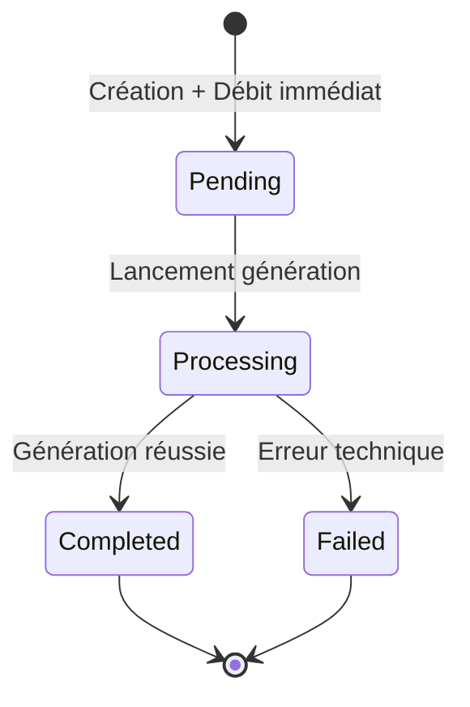

# 🎬 Video Domain

Le domaine vidéo gère le système de génération de vidéos par IA avec gestion des tokens.

## 🎯 Concept métier

### Principe de base
1. **L'utilisateur** soumet un prompt textuel
2. **Le système** calcule le coût et débite immédiatement le wallet
3. **La génération** est créée en statut "pending"
4. **Le processus** de génération vidéo se lance de manière asynchrone

### Cycle de vie d'une génération



**Note** : Les tokens sont débités **immédiatement** lors de la création, pas pendant le processing.

## 🏗️ Entités principales

### VideoGeneration
**Rôle** : Représente une demande de génération vidéo

**Données essentielles** :
- Prompt utilisateur
- Statut du processus
- Coût en tokens
- Liens vers wallet et commande
- URL de la vidéo finale

**États possibles** : `pending` → `processing` → `completed/failed/refunded`

## 💰 Système de coût

### Logique de pricing
- Le **coût** est défini par un produit Sylius
- Le **calcul** est centralisé dans un service dédié  
- La **tarification** peut évoluer via l'admin Sylius

### Intégration wallet
- **Vérification** du solde avant génération
- **Débit** immédiat lors de la création
- **Blocage** de la création si solde insuffisant

## 🛣️ Routes et panneaux

### Routes principales
```
GET    /video-generations        # Liste des générations (index)
GET    /generate                 # Formulaire de création  
POST   /generate                 # Traitement création
DELETE /video-generations/{id}/delete  # Suppression
```

### Structure des panneaux (hooks)

#### Page Index (`/video-generations`)
```
sylius.shop.video_generation.index
├── header          # En-tête de page
├── main            # Contenu principal
│   ├── empty_state # État vide (aucune génération)
│   ├── list        # Liste des générations
│   │   └── item    # Item de génération
│   │       ├── thumbnail  # Miniature vidéo
│   │       └── info       # Informations (statut, date)
│   └── pagination  # Navigation pages
```

#### Page Create (`/generate`)
```
sylius.shop.video_generation.create
├── header     # En-tête "Nouvelle génération"
├── main       # Contenu principal
│   └── form   # Formulaire de création
│       ├── prompt  # Champ prompt (textarea)
│       └── submit  # Bouton de soumission
└── tips       # Conseils d'utilisation
```

### Templates organisés
```
templates/shop/video/generation/
├── index.html.twig    # Page liste
├── create.html.twig   # Page création
├── index/             # Panneaux index
└── create/            # Panneaux création
```
