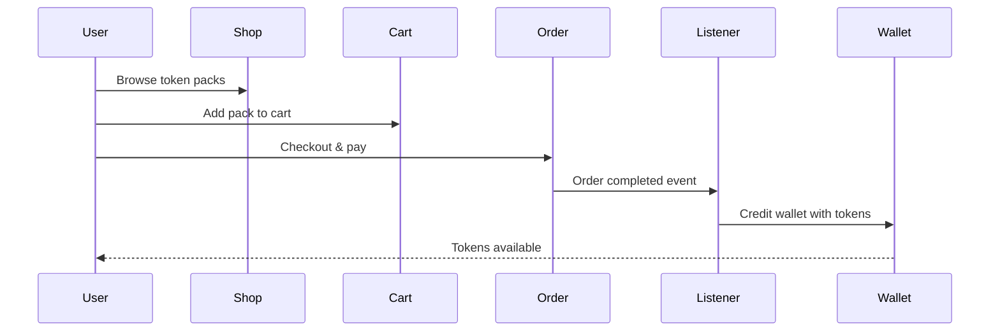

# 💰 Wallet Domain

Documentation du système wallet/tokens dans VideoAI Studio.

## 🎯 Concept Principal

Le système repose sur **deux types de produits** avec des méthodes de paiement différentes :

### 🪙 Produits Token Packs (`token_packs`)
- **Achat** : Checkout classique Sylius avec argent réel (CB, PayPal, etc.)
- **But** : Recharger le wallet en tokens
- **Flux** : Client → Paiement réel → Tokens crédités dans wallet

### 🎬 Produits Génération Vidéo (`video_generation`)  
- **Achat** : Uniquement payable en tokens du wallet
- **But** : "Produit fantôme" pour déclencher la génération IA
- **Flux** : Client → Tokens débités → Génération vidéo lancée

**🔑 Règle clé** : Un panier ne peut contenir qu'un seul type de produit (tokens OU génération).

## 📁 Structure

```
src/Wallet/
├── Entity/
│   ├── Wallet.php                   # Entité wallet
│   ├── WalletTransaction.php        # Transactions
│   └── HasWalletTrait.php           # Trait pour Customer
├── Component/
│   ├── TokenPacksComponent.php      # Live Component
│   └── WalletTransactionChartComponent.php
├── Controller/Shop/Component/
│   └── TokenAddToCartFormComponent.php
├── Payment/                         # CQRS Payment
│   ├── Command/PayWalletCommand.php
│   ├── CommandHandler/PayWalletCommandHandler.php
│   ├── CommandProvider/PayWalletCommandProvider.php
│   └── HttpResponseProvider/PayWalletHttpResponseProvider.php
├── Repository/
│   ├── WalletRepository.php
│   └── WalletTransactionRepository.php
├── Fixture/
│   ├── TokenProductFixture.php
│   └── Factory/CustomProductExampleFactory.php
├── Menu/
│   └── AdminMenuListener.php
├── EventListener/
│   └── TokenPurchaseCompletedListener.php
├── Enum/
│   ├── TransactionType.php
│   └── ProductCode.php
└── Service/
    └── WalletPaymentProvider.php
```

## 💳 Système de paiement

Le domaine Wallet implémente `PaymentProviderInterface` (dans `src/Shared/Payment/`) via `WalletPaymentProvider` pour se découpler du domaine Video.

**➡️ Voir [Shared Domain](shared-domain.md)** pour la logique de filtrage des méthodes de paiement selon le type de produit.

## 🏗️ Entité Wallet

### Configuration Sylius Resource

```php
#[AsResource(
    alias: 'app.wallet',
    section: 'admin',
    templatesDir: '@SyliusAdmin/shared/crud',
    routePrefix: '/admin',
    vars: [
        'header' => 'app.ui.wallets',
        'subheader' => 'app.ui.wallet'
    ],
    operations: [
        new Index(grid: 'app_admin_wallet'),
        new Show(
            vars: [
                'subheader' => 'app.ui.wallet_details',
                'wallet_transactions_grid' => 'app_admin_wallet_transactions_for_wallet',
            ]
        )
    ]
)]
#[ORM\Entity]
class Wallet implements ResourceInterface
```

### Attributs principaux

```php
class Wallet 
{
    #[ORM\Id, ORM\GeneratedValue, ORM\Column(type: 'integer')]
    private ?int $id = null;

    #[ORM\OneToOne(targetEntity: Customer::class, inversedBy: 'wallet')]
    #[ORM\JoinColumn(nullable: false)]
    private Customer $customer;

    #[ORM\Column(type: 'integer')]
    private int $balance = 0;

    #[ORM\OneToMany(targetEntity: WalletTransaction::class, mappedBy: 'wallet')]
    private Collection $transactions;
    
    public function canAfford(int $amount): bool 
    {
        return $this->balance >= $amount;
    }
    
    public function credit(int $amount, string $reference = '', ?\DateTime $createdAt = null): WalletTransaction 
    {
        $this->balance += $amount;
        
        $transaction = new WalletTransaction();
        $transaction->setWallet($this);
        $transaction->setType(TransactionType::CREDIT);
        $transaction->setAmount($amount);
        $transaction->setReference($reference);
        
        return $transaction;
    }
    
    public function debit(int $amount, string $reference = '', ?\DateTime $createdAt = null): WalletTransaction 
    {
        if ($amount > $this->balance) {
            throw new \InvalidArgumentException('app.ui.insufficient_balance');
        }
        
        $this->balance -= $amount;
        
        $transaction = new WalletTransaction();
        $transaction->setWallet($this);
        $transaction->setType(TransactionType::DEBIT);
        $transaction->setAmount($amount);
        $transaction->setReference($reference);
        
        return $transaction;
    }
}
```

## 💳 Entité WalletTransaction

```php
#[ORM\Entity]
class WalletTransaction implements ResourceInterface
{
    use TimestampableEntity;

    #[ORM\Id, ORM\GeneratedValue, ORM\Column(type: 'integer')]
    private ?int $id = null;

    #[ORM\ManyToOne(targetEntity: Wallet::class, inversedBy: 'transactions')]
    #[ORM\JoinColumn(nullable: false)]
    private Wallet $wallet;

    #[ORM\Column(type: 'string', length: 10, enumType: TransactionType::class)]
    private TransactionType $type;

    #[ORM\Column(type: 'integer')]
    private int $amount;

    #[ORM\Column(type: 'string', length: 255, nullable: true)]
    private ?string $reference = null;
}
```

## 🔄 Enum TransactionType

```php
enum TransactionType: string 
{
    case CREDIT = 'credit';
    case DEBIT = 'debit';
    
    public function getLabel(): string 
    {
        return match($this) {
            self::CREDIT => 'Crédit',
            self::DEBIT => 'Débit',
        };
    }
    
    public function getIcon(): string 
    {
        return match($this) {
            self::CREDIT => 'plus-circle',
            self::DEBIT => 'minus-circle',
        };
    }
    
    public function getColor(): string 
    {
        return match($this) {
            self::CREDIT => 'success',
            self::DEBIT => 'danger',
        };
    }
}
```

## 🧩 HasWalletTrait

Trait pour étendre l'entité Customer :

```php
trait HasWalletTrait 
{
    #[ORM\OneToOne(targetEntity: Wallet::class, mappedBy: 'customer', cascade: ['persist'])]
    private ?Wallet $wallet = null;
    
    public function getWallet(): Wallet 
    {
        if (null === $this->wallet) {
            $this->wallet = new Wallet($this);
        }
        
        return $this->wallet;
    }
    
    public function setWallet(?Wallet $wallet): void 
    {
        $this->wallet = $wallet;
        
        if (null !== $wallet) {
            $wallet->setCustomer($this);
        }
    }
}
```

## 🎭 Live Components

### WalletTransactionChartComponent

Graphique des transactions en temps réel :

```php
#[AsLiveComponent(name: 'wallet_transaction_chart')]
class WalletTransactionChartComponent 
{
    #[LiveProp]
    public ?Wallet $wallet = null;
    
    #[LiveProp]
    public string $period = '30d';
    
    public function getChartData(): array 
    {
        if (!$this->wallet) {
            return [];
        }
        
        return $this->walletRepository->getTransactionChartData(
            $this->wallet,
            $this->period
        );
    }
    
    #[LiveAction]
    public function changePeriod(string $newPeriod): void 
    {
        $this->period = $newPeriod;
    }
}
```

### TokenAddToCartFormComponent

Formulaire d'ajout de tokens au panier qui permet de sélectionner directement la variante du pack souhaité (Starter, Pro, Business) et l'ajouter au panier sans passer par une page produit classique.

```php
class TokenAddToCartFormComponent 
{
    #[LiveProp]
    public ?ProductVariant $tokenPack = null;  // Variante sélectionnée (10k, 50k, 100k tokens)
    
    #[LiveAction]
    public function addToCart(): void 
    {
        $this->cartManager->addToCart($this->tokenPack, 1);
        $this->addFlash('success', 'Pack de tokens ajouté au panier');
    }
}
```

## 💳 CQRS Payment System

### PayWalletCommand

```php
class PayWalletCommand 
{
    public function __construct(
        public readonly OrderInterface $order,
        public readonly int $amount,
        public readonly string $currencyCode,
    ) {}
}
```

### PayWalletCommandHandler

```php
class PayWalletCommandHandler 
{
    public function __construct(
        private readonly EntityManagerInterface $entityManager,
        #[Autowire(service: 'debug.state_machine.sylius_payment_request')]
        private readonly StateMachineInterface $paymentRequestStateMachine,
        #[Autowire(service: 'debug.state_machine.sylius_payment')]
        private readonly StateMachineInterface $paymentStateMachine,
    ) {}
    
    public function __invoke(PayWalletCommand $command): void 
    {
        $order = $command->order;
        $customer = $order->getCustomer();
        $wallet = $customer->getWallet();
        
        // Vérifier le solde
        if (!$wallet->canAfford($command->amount)) {
            throw new InsufficientTokensException();
        }
        
        // Débiter le wallet
        $wallet->debit($command->amount, 'Order payment #' . $order->getNumber());
        
        // Marquer le paiement comme réussi
        $payment = $order->getLastPayment();
        $this->paymentStateMachine->apply($payment, PaymentTransitions::COMPLETE);
        
        $this->entityManager->flush();
    }
}
```

## 📊 Grids Sylius

### Grid Wallet (Admin)

```yaml
# config/grids/wallet.yaml
sylius_grid:
    grids:
        app_admin_wallet:
            driver:
                name: doctrine/orm
                options:
                    class: App\Wallet\Entity\Wallet
            fields:
                id:
                    type: string
                    label: ID
                customer:
                    type: twig
                    label: Client
                    options:
                        template: '@SyliusAdmin/shared/grid/field/customer.html.twig'
                balance:
                    type: string
                    label: app.ui.wallet_balance
            actions:
                item:
                    show:
                        type: show
```

### Grid WalletTransaction

```yaml
# config/grids/wallet_transaction.yaml
sylius_grid:
    grids:
        app_admin_wallet_transaction:
            driver:
                name: doctrine/orm
                options:
                    class: App\Wallet\Entity\WalletTransaction
            fields:
                id:
                    type: string
                type:
                    type: twig
                    label: Type
                    options:
                        template: 'admin/Common/Field/transaction_type.html.twig'
                amount:
                    type: twig
                    label: Montant
                    options:
                        template: 'admin/Common/Field/transaction_amount.html.twig'
                reference:
                    type: string
                    label: Référence
                createdAt:
                    type: datetime
                    label: Date
```

## 🎪 Event Listeners

### TokenPurchaseCompletedListener

Écoute les achats de tokens :

```php
class TokenPurchaseCompletedListener 
{
    public function onOrderCompleted(OrderEvent $event): void 
    {
        $order = $event->getOrder();
        
        foreach ($order->getItems() as $item) {
            $product = $item->getProduct();
            
            // Vérifier si c'est un produit token
            if ($this->isTokenProduct($product)) {
                $tokenAmount = $this->getTokenAmount($item);
                $customer = $order->getCustomer();
                
                // Créditer le wallet
                $customer->getWallet()->credit(
                    $tokenAmount,
                    'Token purchase - Order #' . $order->getNumber()
                );
            }
        }
        
        $this->entityManager->flush();
    }
}
```

## 🏭 Fixtures et Factory

Factory pour créer des produits tokens (voir `config/fixtures/token_product.yaml`).

## 🎭 Templates

### Templates wallet

```
templates/
├── admin/
│   ├── Common/Field/          # Champs admin personnalisés
│   │   ├── transaction_amount.html.twig
│   │   ├── transaction_type.html.twig
│   │   └── wallet.html.twig
│   └── wallet/
│       └── show_content.html.twig
├── components/                # Live Components
│   ├── app/
│   │   ├── token_add_to_cart_form.html.twig
│   │   └── token_packs.html.twig
│   └── wallet_transaction_chart.html.twig
└── shop/
    ├── shared/layout/header/
    │   └── wallet_balance.html.twig    # Solde dans header
    └── wallet/
        └── buy.html.twig               # Page achat tokens
```

## 🔌 Hooks Sylius

```yaml
# config/packages/hooks/wallet.yaml
sylius_twig_hooks:
    hooks:
        'sylius_admin.wallet.show.content':
            transactions:
                template: 'admin/wallet/show_content.html.twig'
                priority: 100
```

## 🔄 Flux d'achat de tokens



## 📈 Repository queries optimisées

Requêtes optimisées pour transactions et graphiques (voir `WalletTransactionRepository`).

## 📊 Produits tokens (Fixtures)

Les fixtures créent 3 packs de tokens avec des prix différents :
- **Pack Starter** : 10k tokens pour 9.99€
- **Pack Pro** : 50k tokens pour 39.99€  
- **Pack Business** : 100k tokens pour 69.99€

➡️ **Voir aussi** : [Shared Domain](shared-domain.md) - Interactions cross-domain avec Video
